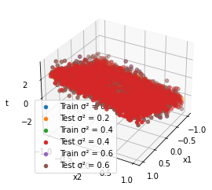
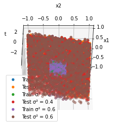

## SF1935 Probability Theory and Statistics with Application to Machine Learning
# Project in Bayesian linear regression
### Laura Nilsson och Leo Svanemar 
### 2023-05-26

## Introduction
In this assignment, Bayesian linear regression and Maximum Likelihood Estimaton (MLE) is used to estimate the parameters of a linear model. The assignment consists of two tasks. In the first task, the parameters are estimated using Bayesian linear regression. In the second task, the parameters are estimated using Bayesian linear regression and MLE. The results are compared and discussed.

**Goals**

- Task 1
  - Implement Bayesian linear regression in a 
  - Obtain the posterior probability
  - Examine prior and posterior over w
  - Examine how adding more data points and varying the noise level affects the accuracy

- Task 2
  - Implement Bayesian linear regression and MLE in a multidimensional input space
  - Examine how varying the noise level and weight parameters affects the model accuracy
  - Examine how training data and test data are affected by those
  - Use batch learning to estimate the parameters

## Method
For both tasks, Python was used. The code is available in the files [`warmup.ipynb`](https://github.com/laurani02/bayesian-project/blob/main/warmup.ipynb) and [`bayesian.ipynb`](https://github.com/laurani02/bayesian-project/blob/main/bayesian.ipynb). The imported and used libraries are scipy, numpy and matplotlib. While SciPy is used in task 1 for multivariate normal distribution and distance calculation, NumPy and Matplotlib are used in both tasks for calculations and visualisation.

## Result

Task 2
____

 

Plotted data from 2.1 and 2.2 är plot1

**2.3 Model fitting with MLE, sigma ∈ {0.2, 0.4, 0.6}**

Mimimun square error (MSE)
MSE (σ² = 0.2) = 0.1971901417530678
MSE (σ² = 0.4) = 0.4491506427837673
MSE (σ² = 0.6) = 0.556552760694397

Minsta error är när sigma = 0.2 (surprise not)

**2.4 Bayesian linear regression with different values of the uncertainty parameter of the Gaussian prior over the weight parameters (α ∈ {0.7, 1.5, 3.0})**
σ² = 0.2
MSE (σ² = 0.2, α = 0.7) = 0.1971494682678761
MSE (σ² = 0.2, α = 1.5) = 0.22452106396164226
MSE (σ² = 0.2, α = 3.0) = 0.18572319863608935
σ² = 0.4
MSE (σ² = 0.4, α = 0.7) = 0.3981424796062423
MSE (σ² = 0.4, α = 1.5) = 0.400761638968057
MSE (σ² = 0.4, α = 3.0) = 0.4069250692467875
σ² = 0.6
MSE (σ² = 0.6, α = 0.7) = 0.6091655155964246
MSE (σ² = 0.6, α = 1.5) = 0.6000864367300098
MSE (σ² = 0.6, α = 3.0) = 0.6091084391212728

**2.5 A comparsion between the frequentist approach MLE and the Bayesian can be made by comparing the MSE. **

Sigma^2 = 0.2, Alpha = 0.7  
Frequentist - Std: 1.0415402095216657  
Frequentist - Mean: 0.029277048894942783  
Bayesian - Std: 1.0407432265081926  
Bayesian - Mean: 0.029264653171258218  

Sigma^2 = 0.2, Alpha = 1.5  
Frequentist - Std: 1.0776108020201185  
Frequentist - Mean: 0.015004771205655066  
Bayesian - Std: 1.0758455310388912  
Bayesian - Mean: 0.01498431885304853  

Sigma^2 = 0.2, Alpha = 3.0  
Frequentist - Std: 1.0702834088950497  
Frequentist - Mean: -0.02684921624949407  
Bayesian - Std: 1.0667830726130483  
Bayesian - Mean: -0.026857178186670293  

Sigma^2 = 0.4, Alpha = 0.7  
Frequentist - Std: 1.106565142489633  
Frequentist - Mean: -0.023208521303072552  
Bayesian - Std: 1.1048732936631402  
Bayesian - Mean: -0.023214406001312315  

Sigma^2 = 0.4, Alpha = 1.5  
Frequentist - Std: 1.065705345433871  
Frequentist - Mean: 0.005538601215642742  
Bayesian - Std: 1.0622195101496643  
Bayesian - Mean: 0.005502790301335658  

Sigma^2 = 0.4, Alpha = 3.0  
Frequentist - Std: 1.0143156039690722  
Frequentist - Mean: -0.0004059187270128801  
Bayesian - Std: 1.0077022567743306  
Bayesian - Mean: -0.0004560067631212476  

Sigma^2 = 0.6, Alpha = 0.7  
Frequentist - Std: 0.9866602056256505  
Frequentist - Mean: 0.0007077539817422582  
Bayesian - Std: 0.9843989345876711  
Bayesian - Mean: 0.0006871280427911734  

Sigma^2 = 0.6, Alpha = 1.5  
Frequentist - Std: 1.0192576516488154  
Frequentist - Mean: 0.004905221804971727  
Bayesian - Std: 1.0142651917051924  
Bayesian - Mean: 0.004859680921884332  

Sigma^2 = 0.6, Alpha = 3.0  
Frequentist - Std: 1.0497923016177393  
Frequentist - Mean: 0.026820761932184155  
Bayesian - Std: 1.039557899736239  
Bayesian - Mean: 0.02668229540784155  

**2.6 Generate predictions also for the training data and compare the uncertainty between the training and test data samples. How does uncertainty (standard deviation) and the quality (mean) of these 2 predictions change with varying α and σ.**

Sigma^2 = 0.2, Alpha = 0.7
Bayesian - Training Data
Std: 0.7876788308751822
Mean: 0.01906156446596578
Bayesian - Test Data
Std: 1.0407432265081926
Mean: 0.029264653171258218

Sigma^2 = 0.2, Alpha = 1.5
Bayesian - Training Data
Std: 0.8142590931095135
Mean: 0.0054173364556214425
Bayesian - Test Data
Std: 1.0758455310388912
Mean: 0.01498431885304853

Sigma^2 = 0.2, Alpha = 3.0
Bayesian - Training Data
Std: 0.8074109491034741
Mean: -0.0354671661765233
Bayesian - Test Data
Std: 1.0667830726130483
Mean: -0.026857178186670293

Sigma^2 = 0.4, Alpha = 0.7
Bayesian - Training Data
Std: 0.8362360388406769
Mean: -0.03247183396026418
Bayesian - Test Data
Std: 1.1048732936631402
Mean: -0.023214406001312315

Sigma^2 = 0.4, Alpha = 1.5
Bayesian - Training Data
Std: 0.8039373853285245
Mean: -0.0045987907860633535
Bayesian - Test Data
Std: 1.0622195101496643
Mean: 0.005502790301335658

Sigma^2 = 0.4, Alpha = 3.0
Bayesian - Training Data
Std: 0.7626958263365937
Mean: -0.008495965609520558
Bayesian - Test Data
Std: 1.0077022567743306
Mean: -0.0004560067631212476

Sigma^2 = 0.6, Alpha = 0.7
Bayesian - Training Data
Std: 0.7450415957809041
Mean: -0.008494992020619851
Bayesian - Test Data
Std: 0.9843989345876711
Mean: 0.0006871280427911734

Sigma^2 = 0.6, Alpha = 1.5
Bayesian - Training Data
Std: 0.7676579896833775
Mean: -0.0036604083407384045
Bayesian - Test Data
Std: 1.0142651917051924
Mean: 0.004859680921884332

Sigma^2 = 0.6, Alpha = 3.0
Bayesian - Training Data
Std: 0.786802911307473
Mean: 0.01810248009176131
Bayesian - Test Data
Std: 1.039557899736239
Mean: 0.02668229540784155

____

## Discussion

vi har lärt oss grejer :)
