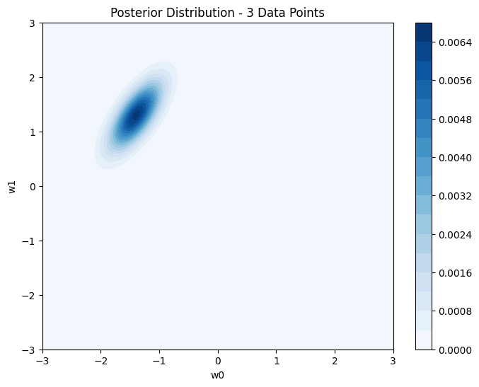
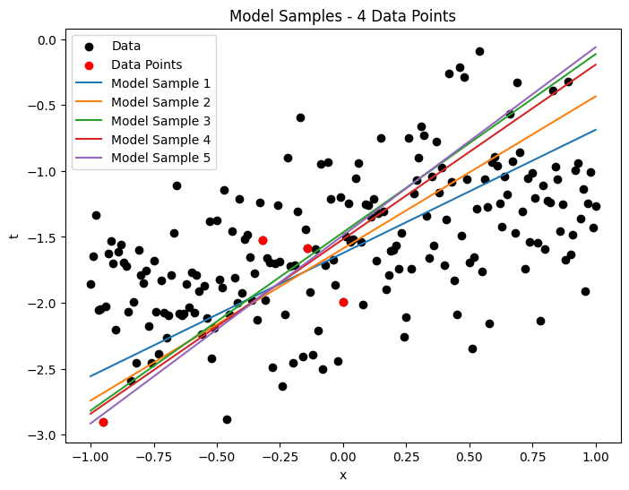

### 
SF1935 Probability Theory and Statistics with Application to Machine Learning

# 
Short report on project assignment

### 
Bayesian linear regression

## 
Leo Svanemar, Laura Nilsson

### 
2023-05-27

____

## Introduction - objectves and scope
In this assignment, Bayesian linear regression and Maximum Likelihood Estimaton (MLE) is used to estimate the parameters of a linear model. The assignment consists of two tasks. In the first task, the parameters are estimated using Bayesian linear regression. In the second task, the parameters are estimated using Bayesian linear regression and MLE. The results are compared and discussed.

**Goals**

- Task 1
  - Implement Bayesian linear regression with one-dimensional input
  - Obtain the posterior probability
  - Examine prior and posterior over w
  - Examine how adding more data points and varying the noise level affects the accuracy

- Task 2
  - Implement Bayesian linear regression and MLE in a multidimensional input space
  - Examine how varying the noise level and weight parameters affects the model accuracy
  - Examine how training data and test data are affected by those
  - Use batch learning to estimate the parameters

## Method
For both tasks, Python was used. The code is available in the files [`warmup.ipynb`](https://github.com/laurani02/bayesian-project/blob/main/warmup.ipynb) and [`bayesian.ipynb`](https://github.com/laurani02/bayesian-project/blob/main/bayesian.ipynb). The imported and used libraries are scipy, numpy and matplotlib. While SciPy is used in task 1 for multivariate normal distribution and distance calculation, NumPy and Matplotlib are used in both tasks for calculations and visualisation.

## Results and discussion

### Task 1
____
**1.1**

  
*1.1: Prior distribution over w.*

 

**1.2**

  
*1.2: Posterior distribution over w for single data point.*

 

**1.3**

  
*1.3: 5 model samples drawn from posterior obtained in 1.2.*

 

**1.4**

  
*1.4.1: Posterior distribution over w for two data points.*

  
*1.4.2: 5 model samples drawn from posterior obtained in 1.4.1*

  
*1.4.3: Posterior distribution over w for three data points.*

  
*1.4.4: 5 model samples drawn from posterior obtained in 1.4.3*

  
*1.4.5: Posterior distribution over w for four data points.*

  
*1.4.6: 5 model samples drawn from posterior obtained in 1.4.5*

  
*1.4.7: Posterior distribution over w for five data points.*

  
*1.4.8: 5 model samples drawn from posterior obtained in 1.4.7*

  
*1.4.9: Posterior distribution over w for six data points.*

  
*1.4.10: 5 model samples drawn from posterior obtained in 1.4.9*

  
*1.4.11: Posterior distribution over w for seven data points.*

  
*1.4.12: 5 model samples drawn from posterior obtained in 1.4.11*

 

**1.5**

The posterior distribution becomes more concentrated and localized the more datapoints you add. The linear models show less variability as more datapoints are added.

 

**1.6**           

|$\sigma ^2$ = 0.1                |$\sigma^2$ = 0.4                 |$\sigma ^2$ = 0.8               |
|---------------------------------|---------------------------------|--------------------------------|
|   |     |    |
|     |     |    |

### Task 2
____
**2.1 och 2.2**  
  
  
*The plotted data.*
  
   
*Another angle, where the location of test vs training data is visible. The division is |x1| > 0.3 and |x2| > 0.3 is test.*

 

**2.3 Model fitting with MLE, sigma ∈ {0.2, 0.4, 0.6}**

Mimimun square error (MSE)  

MSE (σ² = 0.2) = 0.1971901417530678  
MSE (σ² = 0.4) = 0.4491506427837673  
MSE (σ² = 0.6) = 0.556552760694397  

 

**2.4 Bayesian linear regression with different values of the uncertainty parameter of the Gaussian prior over the weight parameters (α ∈ {0.7, 1.5, 3.0})**
  
|σ² = 0.2                                  | σ² = 0.4                                    |σ² = 0.6
|----------------------------------------------|---------------------------------------------|---------------------------------------------
|MSE (σ² = 0.2, α = 0.7) = 0.1971494682678761  |MSE (σ² = 0.4, α = 0.7) = 0.3981424796062423 |MSE (σ² = 0.6, α = 0.7) = 0.6091655155964246
|MSE (σ² = 0.2, α = 1.5) = 0.22452106396164226 |MSE (σ² = 0.4, α = 1.5) = 0.400761638968057  |MSE (σ² = 0.6, α = 1.5) = 0.6000864367300098
|MSE (σ² = 0.2, α = 3.0) = 0.18572319863608935 |MSE (σ² = 0.4, α = 3.0) = 0.4069250692467875 |MSE (σ² = 0.6, α = 3.0) = 0.6091084391212728  

 

**2.5 A comparsion between the frequentist approach MLE and the Bayesian can be made by comparing the MSE.**

**MLE**

MSE (σ² = 0.2) = 0.1971901417530678  
MSE (σ² = 0.4) = 0.4491506427837673  
MSE (σ² = 0.6) = 0.556552760694397  

**Bayesian**

MSE (σ² = 0.2, α = 0.7) = 0.1971494682678761  
MSE (σ² = 0.2, α = 1.5) = 0.22452106396164226  
MSE (σ² = 0.2, α = 3.0) = 0.18572319863608935  
MSE (σ² = 0.4, α = 0.7) = 0.3981424796062423  
MSE (σ² = 0.4, α = 1.5) = 0.400761638968057  
MSE (σ² = 0.4, α = 3.0) = 0.4069250692467875  
MSE (σ² = 0.6, α = 0.7) = 0.6091655155964246  
MSE (σ² = 0.6, α = 1.5) = 0.6000864367300098  
MSE (σ² = 0.6, α = 3.0) = 0.6091084391212728  

 

**2.6 Generate predictions also for the training data and compare the uncertainty between the training and test data samples. How does uncertainty (standard deviation) and the quality (mean) of these 2 predictions change with varying α and σ.**

σ² = 0.2, α = 0.7 
Bayesian - Training Data 
Std: 0.7876788308751822 
Mean: 0.01906156446596578 
Bayesian - Test Data 
Std: 1.0407432265081926 
Mean: 0.029264653171258218 

σ² = 0.2, α = 1.5 
Bayesian - Training Data 
Std: 0.8142590931095135 
Mean: 0.0054173364556214425 
Bayesian - Test Data 
Std: 1.0758455310388912 
Mean: 0.01498431885304853 

σ² = 0.2, α = 3.0 
Bayesian - Training Data 
Std: 0.8074109491034741 
Mean: -0.0354671661765233 
Bayesian - Test Data 
Std: 1.0667830726130483 
Mean: -0.026857178186670293 

σ² = 0.4, α = 0.7 
Bayesian - Training Data 
Std: 0.8362360388406769 
Mean: -0.03247183396026418 
Bayesian - Test Data 
Std: 1.1048732936631402 
Mean: -0.023214406001312315 

σ² = 0.4, α = 1.5 
Bayesian - Training Data 
Std: 0.8039373853285245 
Mean: -0.0045987907860633535 
Bayesian - Test Data 
Std: 1.0622195101496643 
Mean: 0.005502790301335658 

σ² = 0.4, α = 3.0 
Bayesian - Training Data 
Std: 0.7626958263365937 
Mean: -0.008495965609520558 
Bayesian - Test Data 
Std: 1.0077022567743306 
Mean: -0.0004560067631212476 

σ² = 0.6, α = 0.7 
Bayesian - Training Data 
Std: 0.7450415957809041 
Mean: -0.008494992020619851 
Bayesian - Test Data 
Std: 0.9843989345876711 
Mean: 0.0006871280427911734 

σ² = 0.6, α = 1.5 
Bayesian - Training Data 
Std: 0.7676579896833775 
Mean: -0.0036604083407384045 
Bayesian - Test Data 
Std: 1.0142651917051924 
Mean: 0.004859680921884332 

σ² = 0.6, α = 3.0 
Bayesian - Training Data 
Std: 0.786802911307473 
Mean: 0.01810248009176131 
Bayesian - Test Data 
Std: 1.039557899736239 
Mean: 0.02668229540784155 

Bayesian Linear Regression vs. Frequentist Maximum Likelihood:

Bayesian linear regression provides a probabilistic framework that accounts for uncertainty in model parameters.
Frequentist maximum likelihood estimation assumes point estimates of model parameters.
Bayesian approach allows for more flexibility in incorporating prior knowledge and updating beliefs based on observed data.
Effect of Varying Noise Levels:

Increasing the noise level (σ^2) in the data leads to less precise data points.
Higher noise levels result in larger uncertainties in the posterior distribution, reflecting increased uncertainty in the model parameters.
Impact of Adding More Data:

Adding more data points improves the accuracy of the posterior distribution and reduces uncertainty in parameter estimates.
The posterior distribution becomes more concentrated around the true parameter values as more data is incorporated.
Predictive Performance on Test Data:

The predictive performance of Bayesian and frequentist models can be evaluated using test data.
Assessing metrics such as mean squared error (MSE) or predictive uncertainty can provide insights into the models' performance.
Interpretations and Predictions:

Bayesian linear regression allows for quantifying uncertainty in predictions through the posterior distribution.
The choice between Bayesian and frequentist approaches depends on the specific context, available prior knowledge, and the desired level of uncertainty characterization.
Figures and Subplots:

Figures were created to visualize the posterior distribution, model predictions, and model samples.
Subplots were used to present related figures together, aiding in the understanding of the results.
Reporting Quantities:

Quantities such as errors or performance measures were rounded to a reasonable number of decimal digits (usually 2 or 3).
Uncertainty in predictions was also considered and reported whenever applicable.
Overall, the results highlight the advantages of Bayesian linear regression in capturing uncertainty and the impact of data on model estimates. The discussion emphasizes the trade-offs between Bayesian and frequentist approaches, the influence of noise levels, the benefits of incorporating more data, and the evaluation of predictive performance using test data. Figures and subplots were utilized to present the findings visually, supporting the narrative and providing a clear understanding of the key results.

## Final remarks

The lab was confusing at first when getting introduced to the new modelling but it was not all too unfamiliar, as both authors had some knowledge about statistical and probability modelling as well as how to write ML code from previous courses and the rest of SF1935. The simluation outcomes are based on small datasets and due to the discrepancies between training and testing data outcomes cannot be expected to 100% adhere to the theory which is reasonable. 
