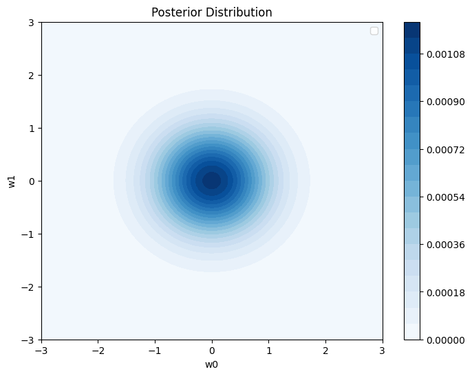
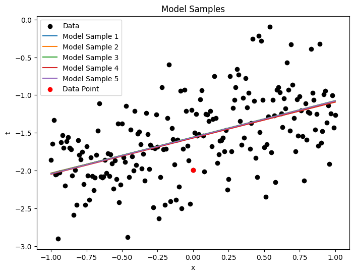
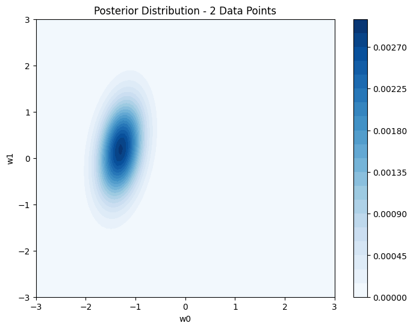
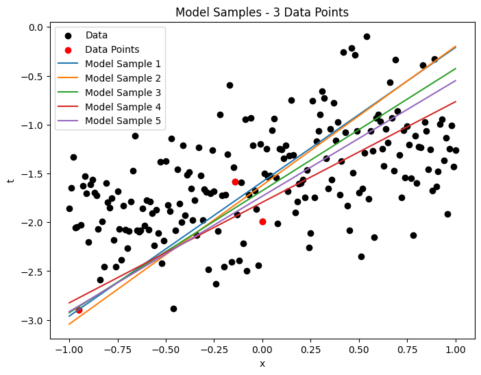
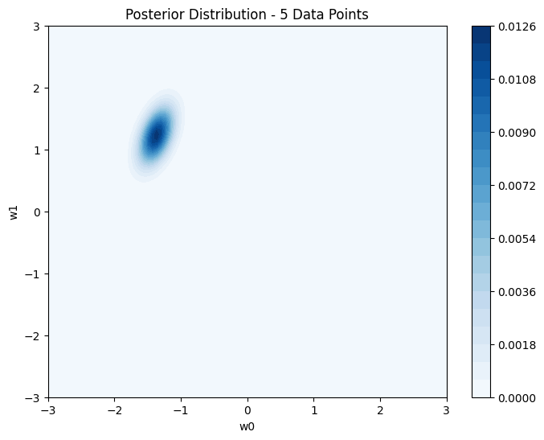

# 
Project in Bayesian linear regression

### 
Laura Nilsson och Leo Svanemar

### 
2023-05-26

### 
SF1935 Probability Theory and Statistics with Application to Machine Learning

____

## Introduction
In this assignment, Bayesian linear regression and Maximum Likelihood Estimaton (MLE) is used to estimate the parameters of a linear model. The assignment consists of two tasks. In the first task, the parameters are estimated using Bayesian linear regression. In the second task, the parameters are estimated using Bayesian linear regression and MLE. The results are compared and discussed.

**Goals**

- Task 1
  - Implement Bayesian linear regression with one-dimensional input
  - Obtain the posterior probability
  - Examine prior and posterior over w
  - Examine how adding more data points and varying the noise level affects the accuracy

- Task 2
  - Implement Bayesian linear regression and MLE in a multidimensional input space
  - Examine how varying the noise level and weight parameters affects the model accuracy
  - Examine how training data and test data are affected by those
  - Use batch learning to estimate the parameters

## Method
For both tasks, Python was used. The code is available in the files [`warmup.ipynb`](https://github.com/laurani02/bayesian-project/blob/main/warmup.ipynb) and [`bayesian.ipynb`](https://github.com/laurani02/bayesian-project/blob/main/bayesian.ipynb). The imported and used libraries are scipy, numpy and matplotlib. While SciPy is used in task 1 for multivariate normal distribution and distance calculation, NumPy and Matplotlib are used in both tasks for calculations and visualisation.

## Result

### Task 1
____
**1.1**

  
*1.1: Prior distribution over w.*

 

**1.2**

  
*1.2: Posterior distribution over w for single data point.*

 

**1.3**

  
*1.3: 5 model samples drawn from posterior obtained in 1.2.*

 

**1.4**

  
*1.4.1: Posterior distribution over w for two data points.*

  
*1.4.2: 5 model samples drawn from posterior obtained in 1.4.1*

  
*1.4.3: Posterior distribution over w for three data points.*

  
*1.4.4: 5 model samples drawn from posterior obtained in 1.4.3*

  
*1.4.5: Posterior distribution over w for four data points.*

  
*1.4.6: 5 model samples drawn from posterior obtained in 1.4.5*

  
*1.4.7: Posterior distribution over w for five data points.*

  
*1.4.8: 5 model samples drawn from posterior obtained in 1.4.7*

  
*1.4.9: Posterior distribution over w for six data points.*

  
*1.4.10: 5 model samples drawn from posterior obtained in 1.4.9*

  
*1.4.11: Posterior distribution over w for seven data points.*

  
*1.4.12: 5 model samples drawn from posterior obtained in 1.4.11*

 

**1.5**

The posterior distribution becomes more concentrated and localized the more datapoints you add. The linear models show less variability as more datapoints are added.

 

**1.6**           

| $\sigma ^2$ = 0.1                | $\sigma^2$ = 0.4                 | $\sigma ^2$ = 0.8                |
| ---------------------------------|----------------------------------|----------------------------------|
|    |    |    |
|      |    |    |

### Task 2
____
**2.1 och 2.2**  
  
  
The plotted data. 
  
   
Another angle, where the location of test vs training data is visible. The division is |x1| > 0.3 and |x2| > 0.3 is test.

 

**2.3 Model fitting with MLE, sigma ∈ {0.2, 0.4, 0.6}**

Mimimun square error (MSE)
MSE (σ² = 0.2) = 0.1971901417530678
MSE (σ² = 0.4) = 0.4491506427837673
MSE (σ² = 0.6) = 0.556552760694397

Minsta error är när sigma = 0.2 (surprise not)

 

**2.4 Bayesian linear regression with different values of the uncertainty parameter of the Gaussian prior over the weight parameters (α ∈ {0.7, 1.5, 3.0})**
  
σ² = 0.2
MSE (σ² = 0.2, α = 0.7) = 0.1971494682678761
MSE (σ² = 0.2, α = 1.5) = 0.22452106396164226
MSE (σ² = 0.2, α = 3.0) = 0.18572319863608935
  
σ² = 0.4
MSE (σ² = 0.4, α = 0.7) = 0.3981424796062423
MSE (σ² = 0.4, α = 1.5) = 0.400761638968057
MSE (σ² = 0.4, α = 3.0) = 0.4069250692467875
  
σ² = 0.6
MSE (σ² = 0.6, α = 0.7) = 0.6091655155964246
MSE (σ² = 0.6, α = 1.5) = 0.6000864367300098
MSE (σ² = 0.6, α = 3.0) = 0.6091084391212728

Minsta error är när sigma = 0.2 (once again surprise not) 
Ngt i diskussionen ksk i stil med: For σ² = 0.2, the model performs best when α = 3.0, with an MSE of ~0.1857. This indicates that a higher uncertainty parameter combined with a lower noise variance leads to better predictions. 

 

**2.5 A comparsion between the frequentist approach MLE and the Bayesian can be made by comparing the MSE.**

**MLE**

MSE (σ² = 0.2) = 0.1971901417530678  
MSE (σ² = 0.4) = 0.4491506427837673  
MSE (σ² = 0.6) = 0.556552760694397  

**Bayesian**

MSE (σ² = 0.2, α = 0.7) = 0.1971494682678761  
MSE (σ² = 0.2, α = 1.5) = 0.22452106396164226  
MSE (σ² = 0.2, α = 3.0) = 0.18572319863608935  
MSE (σ² = 0.4, α = 0.7) = 0.3981424796062423  
MSE (σ² = 0.4, α = 1.5) = 0.400761638968057  
MSE (σ² = 0.4, α = 3.0) = 0.4069250692467875  
MSE (σ² = 0.6, α = 0.7) = 0.6091655155964246  
MSE (σ² = 0.6, α = 1.5) = 0.6000864367300098  
MSE (σ² = 0.6, α = 3.0) = 0.6091084391212728  
  
Inte så stor skillnad. 
Minsta felet är det inte stor skillnad på, men största felet är större med Bayesian än MLE.

 

**2.6 Generate predictions also for the training data and compare the uncertainty between the training and test data samples. How does uncertainty (standard deviation) and the quality (mean) of these 2 predictions change with varying α and σ.**

σ² = 0.2, α = 0.7
Bayesian - Training Data
Std: 0.7876788308751822
Mean: 0.01906156446596578
Bayesian - Test Data
Std: 1.0407432265081926
Mean: 0.029264653171258218

σ² = 0.2, α = 1.5
Bayesian - Training Data
Std: 0.8142590931095135
Mean: 0.0054173364556214425
Bayesian - Test Data
Std: 1.0758455310388912
Mean: 0.01498431885304853

σ² = 0.2, α = 3.0
Bayesian - Training Data
Std: 0.8074109491034741
Mean: -0.0354671661765233
Bayesian - Test Data
Std: 1.0667830726130483
Mean: -0.026857178186670293

σ² = 0.4, α = 0.7
Bayesian - Training Data
Std: 0.8362360388406769
Mean: -0.03247183396026418
Bayesian - Test Data
Std: 1.1048732936631402
Mean: -0.023214406001312315

σ² = 0.4, α = 1.5
Bayesian - Training Data
Std: 0.8039373853285245
Mean: -0.0045987907860633535
Bayesian - Test Data
Std: 1.0622195101496643
Mean: 0.005502790301335658

σ² = 0.4, α = 3.0
Bayesian - Training Data
Std: 0.7626958263365937
Mean: -0.008495965609520558
Bayesian - Test Data
Std: 1.0077022567743306
Mean: -0.0004560067631212476

σ² = 0.6, α = 0.7
Bayesian - Training Data
Std: 0.7450415957809041
Mean: -0.008494992020619851
Bayesian - Test Data
Std: 0.9843989345876711
Mean: 0.0006871280427911734

σ² = 0.6, α = 1.5
Bayesian - Training Data
Std: 0.7676579896833775
Mean: -0.0036604083407384045
Bayesian - Test Data
Std: 1.0142651917051924
Mean: 0.004859680921884332

σ² = 0.6, α = 3.0
Bayesian - Training Data
Std: 0.786802911307473
Mean: 0.01810248009176131
Bayesian - Test Data
Std: 1.039557899736239
Mean: 0.02668229540784155

____

## Discussion

vi har lärt oss grejer :)
